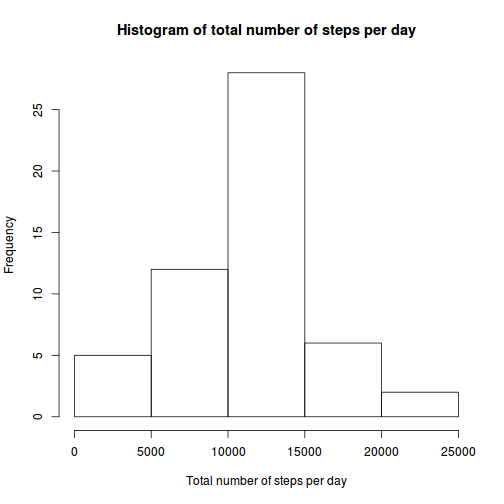
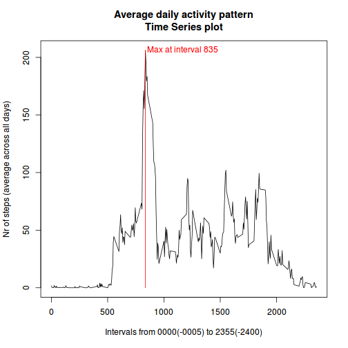
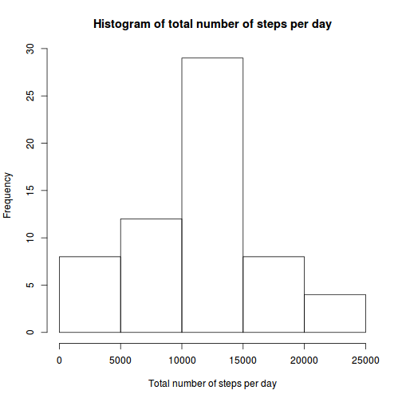
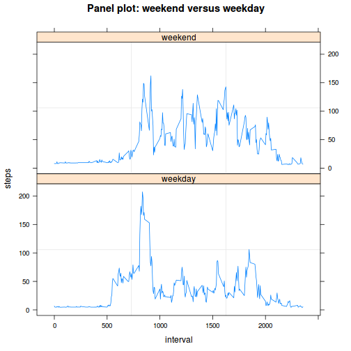

## Loading and preprocessing the data

In the repository, the data is available as a .csv-file compressed into a .zip-file. If the zip-file has not been unpacked already, first unzip it. We then read the .csv file into a variable, which we shall call ```activity.data```.


```r
if (!file.exists('activity.csv')) 
    unzip("activity.zip")
activity.data <- read.csv("activity.csv", as.is=T)[, 1:3]
```

## What is mean total number of steps taken per day?

### 1. Total number of steps per day


```r
# Setup reporting options
options(digits = 2, scipen = 6) # Prevent scientific notation,

# Calculated value to be reported: first calculate total for each day, then calculate the mean
total_nr_of_steps_per_day <- aggregate(activity.data$steps, by=list(activity.data$date), FUN=sum)
mean_total_nr_steps_per_day <- mean(total_nr_of_steps_per_day$x, na.rm=TRUE)
```

The *mean* total number of steps taken per day is **10766.19**.


```r
median(total_nr_of_steps_per_day$x, na.rm=TRUE)
```

```
## [1] 10765
```

### 2. Histogram of the total number of steps taken each day

```r
hist(total_nr_of_steps_per_day$x,
     main="Histogram of total number of steps per day",
     xlab="Total number of steps per day")
```

 

## What is the average daily activity pattern?


```r
## Calculations
avg_steps_for_each_interval <- aggregate(steps ~ interval, data=activity.data, FUN=mean)
interval_with_max_steps <-
    avg_steps_for_each_interval[avg_steps_for_each_interval$steps==max(avg_steps_for_each_interval$steps),]

## Plot daily activity pattern
plot(x=avg_steps_for_each_interval$interval,
     y=avg_steps_for_each_interval$steps, type="l",
     xlab="Intervals from 0000(-0005) to 2355(-2400)",
     ylab="Nr of steps (average across all days)",
     main="Average daily activity pattern")
## Visually depict the interval that has max nr of steps (on avg across all days)
# First draw a vertical line
segments(x0=interval_with_max_steps$interval, y0=0,
         x1=interval_with_max_steps$interval, y1=interval_with_max_steps$steps,col='red')
# Then add a label
text(x=interval_with_max_steps$interval, y=interval_with_max_steps$steps, col='red',
     labels=paste("Max at interval", interval_with_max_steps$interval), pos=4, offset=0.2)
```

 

The interval (starting at) **835** contains
the maximum (206.17) number of steps on average across all the
days in the dataset.

## Imputing missing values

### Step 1: Calculate and report total number of missing values
Calculate *the number of rows with missing values* as the number of incomplete cases (which is the same number).

```r
number_of_missing_values <- sum(!complete.cases(activity.data))
number_of_missing_values # Report it
```

```
## [1] 2304
```

### Step 2 - 3: Fill in the missing values and show a histogram
The **strategy** for filling in the missing values, does not have to be sophisticated: I will therefore use
the mean for each five minute interval.

* The means for each five minute interval will firstly be merged as an 'estimate' into a new, temporary
dataframe called ```activity.data.plus.estimate```.

* Then we will ```replace``` each missing value (NA) with the correct estimate (merged into the same row) and
use it to recreate the original ```activity.data``` data frame, now with the NA's replaced by an estimate.
Also, we will round the estimate (as a number of steps can in reality only be a discrete value).


```r
names(avg_steps_for_each_interval) <- c('interval', 'estimate')
activity.data.plus.estimate <- merge(activity.data, avg_steps_for_each_interval)
activity.data$steps <- replace(activity.data$steps,
                               is.na(activity.data$steps),
                               round(activity.data.plus.estimate$estimate[is.na(activity.data$steps)],
                                     digits=0))
```

### Step 4: Make a histogram of total number of steps per day


```r
total_nr_of_steps_per_day2 <- aggregate(activity.data$steps, by=list(activity.data$date), FUN=sum)
hist(total_nr_of_steps_per_day2$x,
     main="Histogram of total number of steps per day",
     xlab="Total number of steps per day")
```

 

```r
mean(total_nr_of_steps_per_day2$x, na.rm=TRUE)
```

```
## [1] 10889
```

```r
median(total_nr_of_steps_per_day2$x, na.rm=TRUE)
```

```
## [1] 11015
```

If you count the total number of steps per day with NA values *replaced*, the mean and median of the daily **sums** turn out to be (slightly) higher than without the replacement, which is to be expected (NA will not contribute to a sum, while the replacement values will).

## Are there differences in activity patterns between weekdays and weekends?


```r
# Add a weekdays factor variable:

#   I used ```format()``` and ```as.POSIXct()``` because they are not locale-specific and are available in the base-package.
#   I preferred this approach to ```weekdays()```, which is suggested by the assignment but is locale-dependent, so
#   is not guaranteed to work on your system, depending on your locale (or any changes to it)

# Create a vector that for each observation contains the day of the week as number 0-6 (where 0=sunday, ... ,6=saturday)
day.number <- format(strptime(activity.data$date, format='%Y-%m-%d'), format='%w')

# Now map the day.number to weekday.or.weekend factor variable as required, and bind it into activity.data
library(plyr) # Use plyr package for recoding the values
activity.data <-
   cbind(activity.data,
         weekday.or.weekend = as.factor(mapvalues(day.number,
                                                  from=0:6,
                                                  to=c("weekend", "weekday", "weekday", "weekday",
                                                       "weekday", "weekday", "weekend"))))
# Use lattice to make a plot like in the example of R.D. Peng.
pattern.weekday.or.weekend <- aggregate(steps ~ interval + weekday.or.weekend, activity.data, FUN=mean)
library(lattice)
xyplot(steps ~ interval | weekday.or.weekend, data = pattern.weekday.or.weekend, layout = c(1,2),
       panel = function(x, y) {
         panel.grid(h = 1, v = 2)
         panel.xyplot(x, y, type = "l")
       })
```

 
